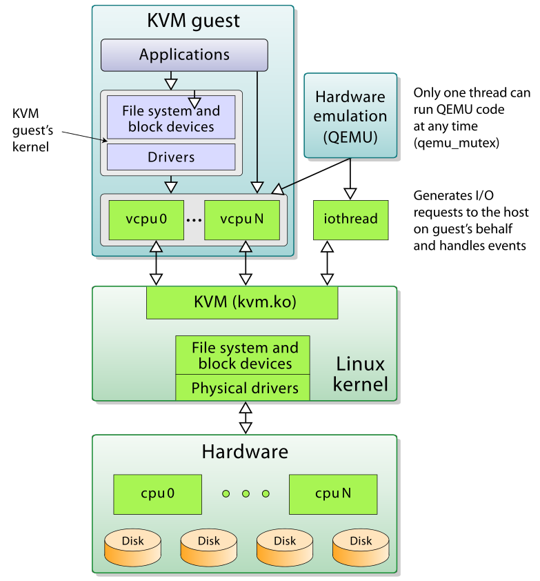

# KVM简介

这里研究KVM为了在本地实现真正的分布式服务器集群，用于搭载K8S平台。

## 虚拟化技术

虚拟化通过在一个物理平台上虚拟出更多的虚拟平台，而其中的每一个虚拟平台则可以作为独立的终端加入云端的分布式系统。比起直接使用物理平台，虚拟化在资源的**有效利用**、**动态调配**和**高可靠性**方面有着巨大的优势。

虚拟化技术引入一个新的**虚拟化层**（x86平台称为**虚拟机监控器** Virtual Machine Monitor, VMM），对下**管理真实的物理资源**，对上**提供虚拟的系统资源**，从而实现了在扩大硬件容量的同时，简化软件的重新配置过程。

实现虚拟化的重要一步就在于，虚拟化层必须能够截获计算元件对物理资源的直接访问，并将其重新定向到虚拟资源池中。

虚拟化划分成为软件虚拟化和硬件虚拟化两种。

### 软件虚拟化

纯软件虚拟化，就是用纯软件的方法在现有的物理平台上（往往并不支持硬件虚拟化）实现对物理平台访问的截获和模拟。

+ QEMU
+ VMWare
+ VirtualBox

### 硬件虚拟化

硬件虚拟化，简而言之，就是物理平台本身提供了对特殊指令的截获和重定向的硬件支持。

## KVM 简介

KVM的全称是Kernel Virtual Machine，即内核虚拟机。

基于Linux kernel，通过加载新的模块从而使Linux Kernel本身变成一个Hypervisor。

KVM 中，虚拟机被实现为常规的 Linux 进程，由标准 Linux 调度程序进行调度；虚机的每个虚拟 CPU 被实现为一个常规的 Linux 进程。这使得 KMV 能够使用 Linux 内核的已有功能。

KVM 本身不执行任何硬件模拟，需要客户空间程序通过 /dev/kvm 接口设置一个客户机虚拟服务器的地址空间，向它提供模拟的 I/O。目前这个应用程序是 QEMU。

KVM只能运行在Linux系统上，但是也可以安装其他系统的虚拟机。

## KVM相关概念

+ 云计算
  + Saas
  + Paas
  + IaaS

## 参考

+ 《KVM虚拟化技术：实战与原理解析》
+ https://linux-kvm.org/page/Main_Page

